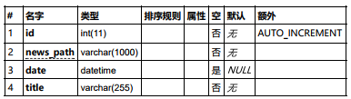
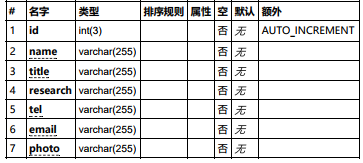
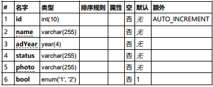
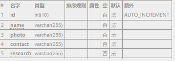
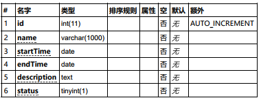
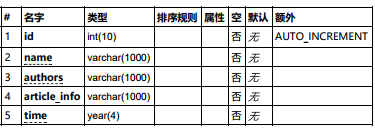
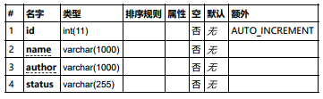

# 实验室网站使用

实验室网站页面分为首页，最新动态，研究团队，研究方向，科研成果，关于我们几个板块。

其中首页介绍实验室的名称是一副大的logo图，研究方向的信息以及关于我们的板块信息基本不会变动，如果需要修改，直接在`index.blade.php`页面中修改。

## 最新动态
该版块展示的是实验室新闻信息。如果需要添加新闻，在`webPage\news`目录下建立相应的`html`文件。该html文件会被预先设计好的样式渲染，因此仅仅需要记住以下的标签样式，便可以像编辑markdown文件一样编辑新闻：
表示   |  样式/标签
------ | -------- 
文章标题 | `

文章标题
作者信息
`
一级标题 | `<h2>标题名称</h2>`
二级标题 | `h3`
三级标题 | `h4`
重要强调 | `strong`
强调文字 | `em`
链接文字 | `a`
图片不换行，靠左边 | `class=img-left`
图片不换行，靠右边 | `class=img-right`
小号图片150*150   | `class=s`
小号图片宽150   | `class=w-s`
中号图片400*400  | `class=m`
中号图片宽400    |  `class=w-m`
大号图片700*700 |    `class=l`
大号图片宽700     |    `class=w-l`
特大图片1000*1000  | `class=xl`
特大图片宽10000   |  `class=w-xl`
占满一行   | `class=xxl`
段落下边距 | `class=p-m`

模板会自动将大标题显示在左侧链接列表 。

### 数据库表结构

表项有新闻html的存储路径（`public\webPage\news\新闻.html`），新闻创建日期，新闻在首页显示的标题。

## 研究团队
### 老师

各个字段代表的是老师的名字、职称、研究方向、电话号码、email、老师的照片的存储路径（`public\assets\images\team\teacher\xx.jpg`或者直接存入照片文件`xx.jpg`）
### 学生

各个字段代表的是学生的名字、入学年份、status（在校学生写研究方向，毕业学生写毕业去向）、学生的照片的存储路径（`public\assets\images\team\student\xx.jpg`或者直接存入照片文件`xx.jpg`）、学业状态（在校【1】，毕业【2】）
### 访问学者

各个字段代表的是访问学者的名字、照片的存储路径（`public\assets\images\team\visitor\xx.jpg`或者直接存入照片文件`xx.jpg`）、联系方式、研究领域

## 科研成果
### 项目

项目名称、项目起始时间、项目预计结束时间、项目描述信息、项目研究状态
### 论文

论文名称、作者信息、论文的会议/期刊信息、论文发表的年份

最终的显示按照最近的年份往前显示

### 专利

专利名称、专利作者、专利的状态